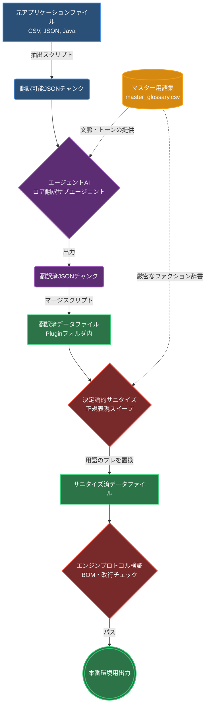
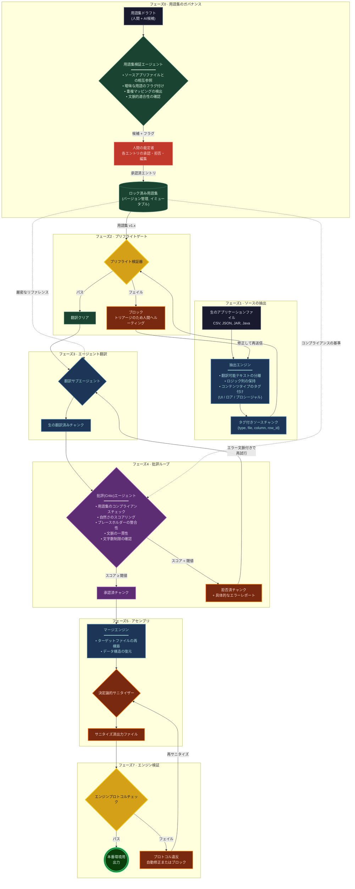

# レガシーJavaローカライズワークフロー

[](README.md)
[](#)

これは翻訳プロジェクトであり、エージェントワークフローを利用して、ローカライズされたメディアを日本のユーザーに提供することを目的としています。ソースコードにアクセスできないハードコードされたJavaアプリケーションをローカライズするには、単なる文字列の置換以上の作業が必要です。このプロジェクトは、バイトコードの操作、エンコーディングのエンジニアリング、AIオーケストレーションパイプラインの設計にまで発展しました。

このドキュメントは、このアーキテクチャの進化、直面した課題、そしてそれらを解決するために構築されたシステムについて詳述するエンジニアリングの記録としての役割を果たします。

## ワークフロー

元のパイプラインは、テキストデータ（CSVおよびJSON）を抽出し、LLMを使用して翻訳し、元にマージして、用語の整合性を確保するための正規表現によるスイープを実行するように設計されていました。



このアーキテクチャは十分なように思えましたが、実際のJavaコードベースに適用すると失敗しました。

## 課題

### 構造の破損
CSVには、テキストと一緒にロジック列が含まれていました。単純な抽出とマージを行うとこれらの列が破損し、エンジンがクラッシュする原因となりました。

具体例として、CSVアーキテクチャにおいて、翻訳可能な列（`name`や`desc`）が、重要なJVMシステムパスやロジックとどのように混在しているかを考えてみましょう。
```csv
name,id,type,tags,...,plugin,ai,desc,sortOrder
SystemNode,node_01,TOGGLE,internal-,...,com.legacyapp.api.impl.nodes.SystemNode,...,Broadcast node identity; required for handshake.,100
```
従来の翻訳エンジンでは、`type`（例：`TOGGLE`）や`plugin`（クラス名）などの列を翻訳してしまうため、すぐにJVMのリフレクションが壊れ、致命的なクラッシュを引き起こします。

### コンテキストの喪失
構造的なコンテキストがないため、AIはUI要素を物語のテキストとして翻訳し、一貫性のないフォーマットを引き起こしました。さらに、翻訳中にテキストが大きく変化しすぎたため、単純な正規表現のパターンマッチングでは用語のズレ（ドリフト）を修正できませんでした。

標準的なシステムエラーメッセージは、高い忠実度で翻訳される必要があります。構造化されたスキーマの検証を行わない、単純な辞書ベースのマッピングでは、ズレが生じてしまいます。

テキストペアの例：
- **元のテキスト:** `"Compiled for the wrong version of Java, change the compile target to Java 7"`
  **ターゲット:** `"誤ったバージョンのJavaでコンパイルされています。コンパイルターゲットをJava 7に変更してください。"`
- **元のテキスト:** `"Are you sure? You'll lose any changes you've made to the settings."`
  **ターゲット:** `"本当によろしいですか？変更した設定はすべて失われます。"`
- **元のテキスト:** `"Error in sound initialization, proceeding with sound disabled."`
  **ターゲット:** `"サウンドの初期化でエラーが発生しました。サウンドを無効にして続行します。"`

### ハードコードされた文字列
データファイルを翻訳するだけでは不十分でした。外部のローカライズファイルがなく、コンパイルされたJavaバイトコード（`.jar`ファイル）に直接焼き込まれているコアUI文字列が多数存在しました。

### Shift-JIS エンコーディング
アプリケーションはShift-JISエンコーディングに依存していましたが、最新のNLPツールはUTF-8を使用します。厳密なエンコーディングの管理なしでデータを転送すると、データの破損、バイトオーダーマーク（BOM）の欠落、および改行セマンティクスの破壊を引き起こしました。

## ワークフロー：リマスター版

これらの問題を解決するために、新しいエージェントワークフローを構築しました。焦点を「テキストの翻訳」から「翻訳を安全に行える制限された環境の構築」へと移しました。



### プリフライトルーティングと抽出
フェーズ1では、テキストをアプリケーションロジックから切り離します。CSVヘッダーを解析してターゲットの文字列インデックスを分離し、周囲のデータ構造には手を加えません。

```python
# フェーズ3（マージと翻訳）からのスニペットで、構造的保存を強調しています。
with open(out_path, 'a' if start_idx > 1 else 'w', encoding='utf-8', newline='') as f:
    writer = csv.writer(f)
    if start_idx == 1:
        writer.writerow(headers)
        
    for row in reader[start_idx:]:
        if len(row) > name_idx and row[name_idx].strip():
            row[name_idx] = safe_translate(row[name_idx])
        if desc_idx != -1 and len(row) > desc_idx and row[desc_idx].strip():
            row[desc_idx] = safe_translate(row[desc_idx])
        if short_idx != -1 and len(row) > short_idx and row[short_idx].strip():
            row[short_idx] = safe_translate(row[short_idx])
        writer.writerow(row)
        f.flush()
```

### 批評ループ
コンテキスト喪失の問題を解決するために、閉ループの批評システム（フェーズ4）が導入されました。翻訳サブエージェントからの出力は批評エージェントに渡され、フェーズ0で作成された不変の用語集に照らして翻訳がスコアリングされます。チャンクがコンテキスト、長さ、または用語のチェックに合格しなかった場合、それは拒否され、エラーレポートとともに送り返されます。

### Javassistバイトコードインジェクション
`.jar`ファイル内のハードコードされた文字列を翻訳するために、**Javassist**ライブラリを使用してバイトコード操作ツールセットを構築しました。アプリケーションの起動時に、フックがレンダリングクラスをインターセプトし、Javaメソッドに直接ロジックを注入します。オフラインでバイトコードを翻訳するのではなく、このツールは実行時に`setText`メソッドとクラスコンストラクターを変更して、注入された翻訳マップから日本語の等価文字列を検索します。

```java
// StaticInjector.java のスニペット
String[] targetClasses = {
    "com.legacyapp.ui.d",
    "com.legacyapp.ui.impl.if",
    "com.legacyapp.ui.n",
    "com.legacyapp.ui.new",
    "com.legacyapp.ui.t"
};

// 各クラスの setText(String) メソッド用の Javassist 注入コード：
String injectionCode = "{"
        + "  if ($1 != null && com.localizationplugin.Core.TR.containsKey($1)) {"
        + "      $1 = (String) com.localizationplugin.Core.TR.get($1);"
        + "  }"
        + "}";
```

## 実現可能性の評価

これによって誤訳を最小限に抑えることはできるか？ **はい。**
このワークフローは、用語のズレ、エンコーディングの破損、フォーマット違反など、幅広いクラスのエラーを捕捉して修正します。ローカリゼーションプロジェクトにおいて、これは実現可能であり、従来のファントランスレーション（非公式翻訳）の手法よりも優れたパフォーマンスを発揮します。

これによって誤訳をゼロにすることはできるか？ **いいえ。**
誤訳をゼロにするには、文脈上のエラーを絶対に起こさない完璧なAIか、あるいは翻訳されたすべての文字列の完全な人間のレビューが必要であり、これは自動化の目的に反します。このワークフローは、個々の文字列レベルで約90〜95％の正確さの出力を生成し、サニタイザーによって固有名詞の一貫性は100％近くまで押し上げられます。

## なぜエージェントワークフローを構築するのか？

プロジェクトの規模の大きさから、自動化されたアプローチが求められました。抽出時において、パイプラインは49以上のデータファイルにわたって8,300以上のテキストチャンクを解析します。この量のテキストを手動で翻訳し、検証することは、特に複雑なCSV構造や厳密な用語準拠の必要性を扱う場合、時間がかかるだけでなく人的エラーが発生しやすくなります。

エージェントワークフローにより、翻訳タスクの並行処理が可能になり、プロジェクトの完了に必要な時間が大幅に短縮されます。さらに、批評（Critic）ループの統合により、文脈の喪失や用語のズレによって発生する可能性のあるエラーを捕捉し、翻訳の品質が維持されます。

## 教訓

### APIレート制限
何千ものテキストチャンクに対して並列でサブエージェントを実行した際、主なボトルネックはAPIのレート制限でした。形式が正しくない、あるいは翻訳不可能なチャンクでレート制限のクォータを無駄に消費するのを防ぐために、プリフライト検証ゲート（フェーズ2）が実装されました。

### 非標準HJSON
このアプリケーションは、コメント（`#`）や標準のJSONパーサーを壊す末尾のカンマを含むカスタムHJSON構成を利用していました：
```hjson
# 内部アプリケーションのキャッシュ設定
"enableScriptCaching":false, # コンパイルされたスクリプトをメモリにキャッシュし、初回起動後の起動時間を短縮する
"doMemoryChecks":true, # 定期的にメモリ不足をチェックし、ユーザーに警告する
},
```
この構文では、標準のPython `json.loads`は `json.decoder.JSONDecodeError`をスローします。抽出エンジンは、カスタムの正規表現を使用して、HJSONを準拠したRFC-8259 JSONに前処理してから、翻訳エージェントに渡します。

### 複合キーの衝突
いくつかのファイルでは、エントリを区別するために複合キーを使用していました。単純にキーを翻訳すると、異なる構造的エンティティ（例：カスタムシステムモジュールとレジストリエントリ）を表す重複するキー属性が発生することが多々ありました。
```csv
id,type,text1
network_bridge,PLUGINULE,A deployable network bridge pluginule...
network_bridge,REGISTRY,Network bridge registry entry...
```
キー `network_bridge` を翻訳すると、コンパイル時にキーの重複エラーが発生してしまいます。抽出スクリプトは、一意性を保証するために複合キー `id|type` （例：`network_bridge|PLUGINULE` と `network_bridge|REGISTRY`）を生成します。サニタイザーは、これらの構造的な衝突を検出して解決するための動的ロジックを必要としました。

## まとめ

ワークフローを明確なレイヤーに分割することで、コンパイルされたソースを壊す人的エラーのリスクを減らすことができました。このシステムは、最新のNLPツールとレガシーJava環境を橋渡しし、安定したデプロイをもたらします。エージェントワークフローは完璧ではありませんが、ソースコードにアクセスせずに複雑なアプリケーションをローカライズするための、スケーラブルで効率的なソリューションを提供します。検証ゲートと批評ループを統合することで、構造の破損、コンテキストの喪失、エンコーディングの問題といった課題を乗り越えながら、翻訳の品質を維持することができます。
