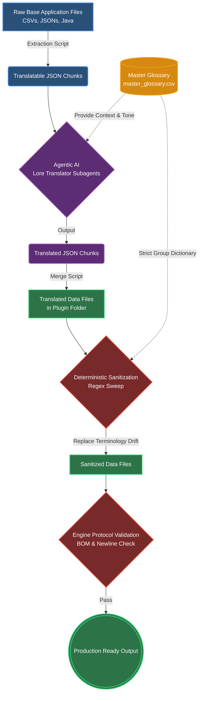
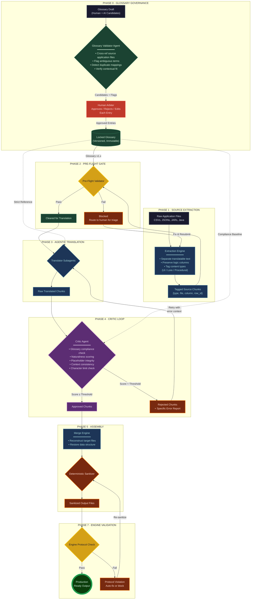

# Legacy Java Localization Workflow

This is a translation project, with the intent of the agentic workflow to expose the localized media to the Japanese audience. Localizing a hardcoded Java application without source access requires more than simple string replacement. This project evolved into an exercise in bytecode manipulation, encoding engineering, and designing AI orchestration pipelines.

This document serves as an engineering narrative detailing the evolution of this architecture—the challenges faced and the systems built to solve them.

## The Workflow

The original pipeline was designed to extract text data (CSVs and JSONs), use an LLM for translation, merge it back, and perform a Regex sweep to ensure terminology compliance.



While this architecture seemed sufficient, it failed when applied to the actual Java codebase.

## Challenges

### Structural Corruption
The CSVs contained logic columns alongside text. Basic extraction and merging corrupted these columns, causing the engine to crash.

To illustrate, consider how translatable columns (`name` and `desc`) are interleaved with critical JVM system paths and logic in the CSV architecture:
```csv
name,id,type,tags,...,plugin,ai,desc,sortOrder
SystemNode,node_01,TOGGLE,internal-,...,com.legacyapp.api.impl.nodes.SystemNode,...,Broadcast node identity; required for handshake.,100
```
Traditional translation engines translating columns like `type` (e.g. `TOGGLE`) or `plugin` (class names) immediately break JVM reflection and cause catastrophic crashes.

### Context Loss
Without structural context, the AI translated UI elements as narrative text, causing inconsistent formatting. Additionally, the text changed too much during translation for simple regex pattern matching to fix terminology drift.

Standard system error messages must be translated with high fidelity. Naive dictionary-based mapping drifts without structured schema verification.

Examples of Text Pairs:
- **Source:** `"Compiled for the wrong version of Java, change the compile target to Java 7"`
  **Target:** `"誤ったバージョンのJavaでコンパイルされています。コンパイルターゲットをJava 7に変更してください。"`
- **Source:** `"Are you sure? You'll lose any changes you've made to the settings."`
  **Target:** `"本当によろしいですか？変更した設定はすべて失われます。"`
- **Source:** `"Error in sound initialization, proceeding with sound disabled."`
  **Target:** `"サウンドの初期化でエラーが発生しました。サウンドを無効にして続行します。"`

### Hardcoded Strings
Translating data files was not enough. Many core UI strings were baked directly into the compiled Java bytecode (`.jar` files) without external localization files.

### Shift-JIS Encoding
The application relied on Shift-JIS encoding, while pluginern NLP tools use UTF-8. Transferring data without strict encoding governance caused data corruption, missing Byte Order Marks (BOMs), and broken newline semantics.

## The Workflow: Remastered

To solve these issues, I built a new agentic workflow. The focus shifted from translating text to building a restrictive environment where translation can safely occur.



### Pre-Flight Routing & Extraction
Phase 1 untangles text from application logic. It parses CSV headers and isolates the target string indices, leaving the surrounding data structure untouched. 

```python
# Snippet from Phase 3: Merging & Translation, highlighting structural preservation
with open(out_path, 'a' if start_idx > 1 else 'w', encoding='utf-8', newline='') as f:
    writer = csv.writer(f)
    if start_idx == 1:
        writer.writerow(headers)
        
    for row in reader[start_idx:]:
        if len(row) > name_idx and row[name_idx].strip():
            row[name_idx] = safe_translate(row[name_idx])
        if desc_idx != -1 and len(row) > desc_idx and row[desc_idx].strip():
            row[desc_idx] = safe_translate(row[desc_idx])
        if short_idx != -1 and len(row) > short_idx and row[short_idx].strip():
            row[short_idx] = safe_translate(row[short_idx])
        writer.writerow(row)
        f.flush()
```

### The Critic Loop
To solve context loss, a closed-loop critic system (Phase 4) was introduced. The output from Translator subagents is passed to a Critic Agent that scores the translation against an immutable Glossary from Phase 0. If the chunk fails context, length, or terminology checks, it is rejected and sent back with an error report.

### Javassist Bytecode Injection
To translate hardcoded strings inside `.jar` files, I built a bytecode manipulation toolset using the **Javassist** library. As the application boots up, a hook intercepts the rendering classes and injects logic directly into the Java methods. Instead of translating the bytecode offline, the tool pluginifies `setText` methods and class constructors at runtime to look up Japanese equivalents from an injected translation map.

```java
// Snippet from StaticInjector.java
String[] targetClasses = {
    "com.legacyapp.ui.d",
    "com.legacyapp.ui.impl.if",
    "com.legacyapp.ui.n",
    "com.legacyapp.ui.new",
    "com.legacyapp.ui.t"
};

// Javassist injection code for each class's setText(String) method:
String injectionCode = "{"
        + "  if ($1 != null && com.localizationplugin.Core.TR.containsKey($1)) {"
        + "      $1 = (String) com.localizationplugin.Core.TR.get($1);"
        + "  }"
        + "}";
```

## Feasibility Assessment

Can this achieve minimal mistranslations? **Yes.**
The workflow catches and fixes broad classes of errors, such as terminology drift, encoding corruption, and format violations. For a localization project, this is feasible and performs better than traditional fan translation methods.

Can this achieve zero mistranslations? **No.**
Zero mistranslation requires either a perfect AI that never makes contextual errors, or a complete human review of every translated string, which defeats the purpose of automation. This workflow produces output that is roughly 90-95% correct at the individual string level, with the sanitizer pushing the consistency of proper nouns close to 100%.

## Why build an Agentic Workflow?

The scale of the project demanded an automated approach. During extraction, the pipeline parses over 8,300+ text chunks across 49+ data files. Manually translating and validating this volume of text is not only time-consuming but also prone to human error, especially when dealing with complex CSV structures and the need for strict terminology compliance.

The agentic workflow allows for parallel processing of translation tasks, significantly reducing the time required to complete the project. Additionally, the integration of a critic loop ensures that the quality of translations is maintained, catching errors that may arise from context loss or terminology drift.

## Moral Lessons

### API Rate Limits
When running parallel subagents on thousands of text chunks, the main bottleneck was API rate limits. The Pre-Flight Validation gate (Phase 2) was implemented to prevent burning through rate limit quotas on malformed or untranslatable chunks.

### Non-Standard HJSON
The application utilized a custom HJSON configuration containing comments (`#`) and trailing commas that break standard JSON parsers:
```hjson
# Internal application caching settings
"enableScriptCaching":false, # caches compiled scripts in memory, faster startup time after first run
"doMemoryChecks":true, # will periodically check if memory is low and warn the user
},
```
Standard Python `json.loads` throws `json.decoder.JSONDecodeError` on this syntax. The extraction engine uses custom regular expressions to preprocess the HJSON into compliant RFC-8259 JSON before passing it to the translation agent.

### Composite Key Collisions
Several files used composite keys to differentiate entries. Naively translating keys often resulted in duplicate key attributes that represent different structural entities (e.g., a custom system pluginule vs. a registry entry):
```csv
id,type,text1
network_bridge,PLUGINULE,A deployable network bridge pluginule...
network_bridge,REGISTRY,Network bridge registry entry...
```
Translating the key `network_bridge` would cause duplicate key errors upon compilation. The extraction script generates a composite key `id|type` (e.g., `network_bridge|PLUGINULE` and `network_bridge|REGISTRY`) to guarantee uniqueness. The sanitizer required dynamic logic to detect and resolve these structural collisions.

## Summary
 
By separating the workflow into distinct layers, I reduced the risk of human error breaking the compiled source. This system bridges pluginern NLP tools and legacy Java environments, resulting in a stable deployment. The agentic workflow is not perfect, but it provides a scalable and efficient solution for localizing a complex application without source access. The integration of validation gates and critic loops ensures that the quality of translations is maintained while navigating the challenges of structural corruption, context loss, and encoding issues.
